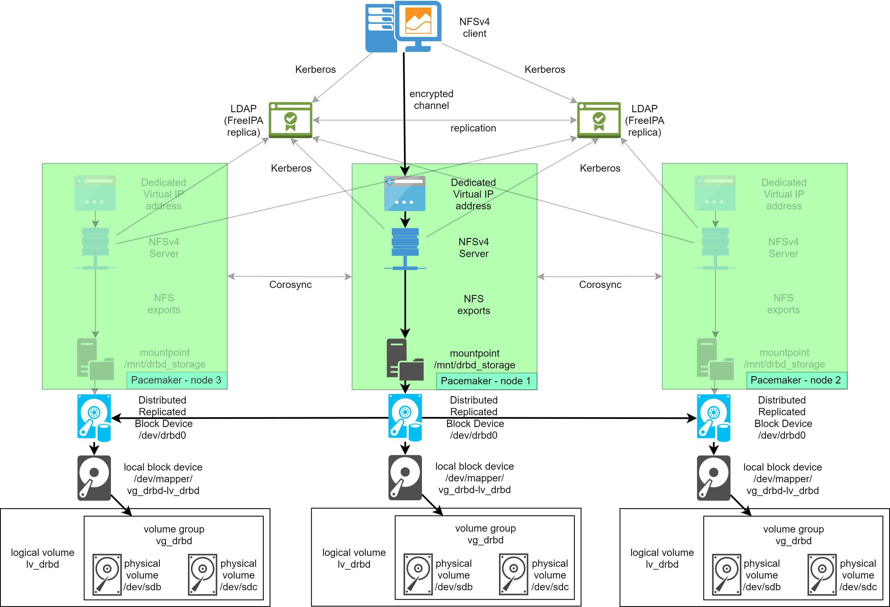

#### Высокодоступное файловое хранилище с централизованной аутентификацией

Используемые технологии:
- Pacemaker & Corosync
- DRBD
- LDAP & Kerberos (FreeIPA)
- NFSv4

* [Справочная информация по стенду](docs/help.md).

* Развертывание:
  * [Базовая подготовка хостов и настройка сети](docs/base.md)
  * [Установка систем аутентификации](docs/auth.md)
  * [Создание тома DRBD](docs/drbd.md)
  * [Установка сервера NFSv4 и его интеграция с Kerberos](docs/nfsv4_server.md)
  * [Развертывание и конфигурирование кластера под управлением Pacemaker](docs/pcm.md)
  * [Подключение клиента NFSv4 и демонстрация отказа ноды](docs/nfsv4_client.md)
