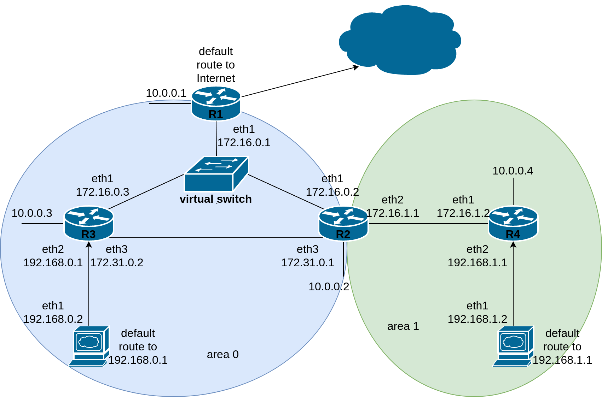

## Базовый стенд для практики в настройке OSPFv2 на Linux.

Попробуйте настроить OSPF ориентируясь на приведенную ниже схему.
Все маршрутизаторы должны знать обо всех сетях, включая loopback.
Все маршрутизаторы и рабочие станции должны иметь доступ в Интернет.



Для развёртывания стенда у вас должен быть установлен ```virtualbox```, ```vagrant``` и ```ansible```.
Выполните ```vagrant up```: будут автоматически развёрнуты роутеры и клиенты. На роутерах будет установлена quagga. На клиентах будут прописаны default gateway до ближайших роутеров.

Для конфигурирования используйте программу ```vtysh``` от root.

Пример конфигурации с командами:

```
interface eth1 
ip ospf dead-interval 12
ip ospf hello-interval 3
ip ospf network broadcast

interface eth2
ip ospf cost 1000
ip ospf network point-to-point 

router ospf
 ospf router-id 10.0.0.10
 passive-interface default
 no passive-interface eth1
 no passive-interface eth2
 network 10.0.0.10/32 area 0.0.0.0
 network 172.16.0.0/24 area 0.0.0.0
 network 172.16.1.0/24 area 0.0.0.1
 network 172.31.0.0/24 area 0.0.0.0
 neighbor 172.31.0.2

```

Полезные команды:
```
show interface
show ip route
show ip route ospf
show ip ospf
show ip ospf neighbor
```

