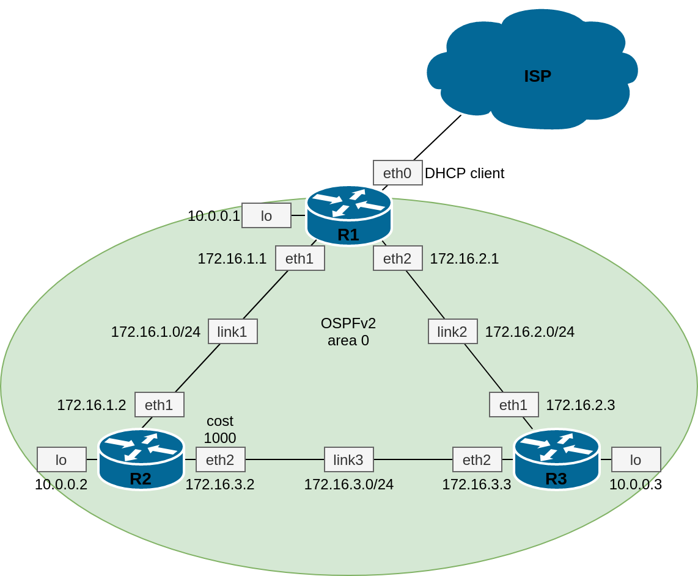

## Курс "Администратор Linux" OTUS.RU

### Методические указания по выполнению практической работы "Динамическая маршрутизация".

Практическая работа:  

1. Развернуть 3 виртуальных машины;
2. Объединить эти виртуальные машины разными виртуальными каналами;
3. Настроить OSPFv2 между виртуальными машинами на базе quagga;
4. Настроить ассиметричную маршрутизацию;
5. Восстановить симметричеую маршрутизацию не уменьшая цену интерфейса из п.4.

Формат сдачи: Vagrantfile + ansible

## Построение схемы сети

При проектировании сети любой сложности является хорошим тоном иметь схемы и таблицы с указанием, как минимум, устройств, каналов, интерфейсов и адресов. В нашем случае это будут 3 программных роутера на базе linux, объединенных независимыми каналами. При этом, один из этих роутеров, в отличие от остальных, должен иметь доступ к сети Интернет и будет являться шлюзом для остальных. IP-адресация в пределах независимых каналов должна быть уникальной.  

| Канал | Адресация |
|-------|-----------|
| ISP   | DHCP client    |
| link1 | 172.168.1.0/24 |
| link2 | 172.168.2.0/24 |
| link3 | 172.168.3.0/24 |

| Устройство | Интерфейс | Адрес |
|------------|-----------|-------|
| R1 | lo | 10.0.0.1/32 | 
| R1 | eth0 | vagrant DHCP | 
| R1 | eth1 | 172.16.1.1/24 |
| R1 | eth2 | 172.16.2.1/24 | 
| R2 | lo | 10.0.0.2/32 | 
| R2 | eth0 | vagrant DHCP | 
| R2 | eth1 | 172.16.1.2/24 |
| R2 | eth2 | 172.16.3.2/24 | 
| R3 | lo | 10.0.0.3/32 | 
| R3 | eth0 | vagrant DHCP | 
| R3 | eth1 | 172.16.2.3/24 |
| R3 | eth2 | 172.16.3.3/24 | 

Предлагается использовать следующую схему (исходный файл в формате draw.io расположен в директории docs):  

## Подготовка vagrantfile

    В данной работе нам потребуется развернуть 3 ВМ, объединенных независимыми, приватными сетями.