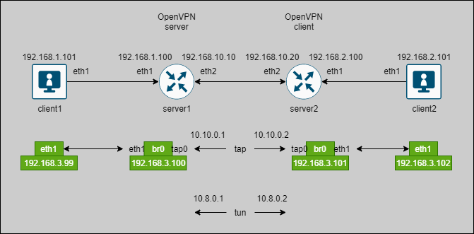

## OpenVPN tap/tun example

How to use:
1. Make sure that Vagrant and VirtualBox installed;
2. Generate file `static.key` with command `openvpn --genkey --secret static.key` or you can use this sample:
```bash
#
# 2048 bit OpenVPN static key
#
-----BEGIN OpenVPN Static key V1-----
11ec2b815e1bc1ccaf8e2ab5584afcf3
726d119c896344b241f4c55f19954dc0
6c1673513740d1d9890b31bfac98e9e3
49b19b063ce5d42af608f18310ba721d
3ed78b75e6b1eefead3f957de9d0de6b
08a92c644d72a10a46ad0bf6d26704f3
3075e567b1018b8d4e7d0de28817002f
50a1856e9468496a7a44bbfa4e68d9c6
60f5e718ecf1b66c2c6bd7c087749673
f0769d2ac306651f93cd7b3d11811358
d7e72bfda0de53fed50ace66aa233d8c
f755fa0a8eee53f326fda6ece0c4957b
112500d9e9026c0d72a8baa763eeefa8
39a41cf08b957ecd612859dd8fda8a44
11c73a5fa891ebe0e57d820d93b1d931
e950327e8677005dbd8d61e824e08063
-----END OpenVPN Static key V1-----
```
3. Run `vagrant up`
4. Check that TAPs over bridges are working
```
vagrant ssh client1
ping 192.168.3.99
ping 192.168.3.100
ping 192.168.3.101
ping 192.168.3.102
```
5. Check that ARP is available
```
vagrant ssh client1
arping 192.168.3.102 -I eth1
```
6. Check data transfer speed with iperf
 - run `iperf3 -s` on __client1__
 - run `iperf3 -c 192.168.3.99 -i 5 -t 60 -b50M -u` on __client2__


P.S. TUN also available. Just stop TAP VPN then start TUN VPN.
 - run `systemctl stop openvpn-client@tap` on __server2__
 - run `systemctl stop openvpn-server@tap` on __server1__
 - run `systemctl stop openvpn-server@tun` on __server1__
 - run `systemctl stop openvpn-client@tun` on __server2__
 - check connection by `ping 10.8.0.1` and `ping 10.8.0.2`
 - create routing rules by yourself because there is no routing rules!

## Scheme


